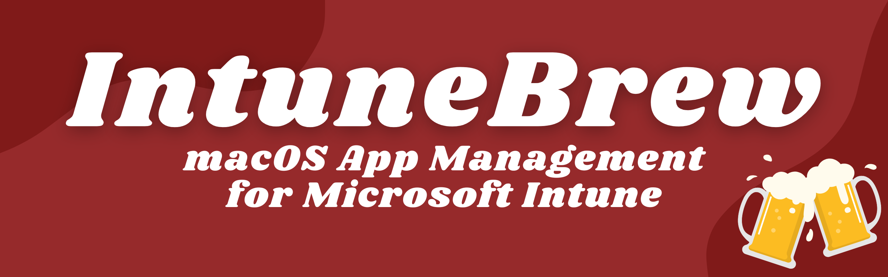

# IntuneBrew 🍺

A macOS app management tool for Microsoft Intune, designed to help IT administrators keep their Intune-managed macOS applications up to date.



## Features

- 🔄 Check your Intune apps against the latest available versions
- 📱 Modern, user-friendly interface
- 🚀 Quick status overview of all your apps
- 🔐 Secure Microsoft authentication
- 📦 Regular updates with new supported apps

## Prerequisites

- Python 3.11 or higher (\<3.13 recommended)
- Microsoft Intune access
- Azure App Registration with the following settings:
  - Redirect URI: `http://localhost:3000`
  - Required permissions: `DeviceManagementApps.ReadWrite.All`

## Setup Instructions

1. Clone the repository:
   ```bash
   git clone https://github.com/merlinfrombelgium/IntuneBrew
   cd IntuneBrew
   ```

2. Create and activate a virtual environment:
   ```bash
   # On macOS/Linux
   python3 -m venv .venv
   source .venv/bin/activate

   # On Windows
   python -m venv .venv
   .venv\Scripts\activate
   ```

3. Install dependencies:
   ```bash
   pip install -r requirements.txt
   ```

4. Create a `config.json` file in the root directory:
   ```json
   {
     "azure": {
       "tenantId": "your-tenant-id",
       "appId": "your-app-id",
     }
   }
   ```

5. Start the application:
   ```bash
   python app.py
   ```

6. Open your browser and navigate to:
   ```
   http://localhost:3000
   ```

## Usage

1. Authenticate with your Microsoft account (you must allow pop-ups in your browser)
2. The app will display all supported applications with their current status:
   - 🟢 Up-to-date: App version in Intune matches the latest available version
   - 🟡 Needs Update: A newer version is available
   - 🔴 Not in Intune: App is not currently deployed in your Intune environment

## Supported Applications

IntuneBrew supports a growing list of popular macOS applications. The full list is available in the `Apps` directory.

## Contributing

Want to add support for more apps? Great! Here's how:

1. Create a new JSON file in the `Apps` directory with the app's metadata:
   ```json
   {
     "name": "App Name",
     "description": "Brief description",
     "version": "1.2.3",
     "url": "https://download.url/app-1.2.3.pkg",
     "bundleId": "com.example.app",
     "homepage": "https://app.example.com",
     "fileName": "app-1.2.3.pkg"
   }
   ```

2. Add the app's logo (PNG format) to the `Logos` directory
3. Submit a pull request

## License

This project is licensed under the MIT License - see the [LICENSE](LICENSE) file for details.

## Acknowledgments

Original project made with ❤️ by [Ugur Koc](https://github.com/ugurkocde)
